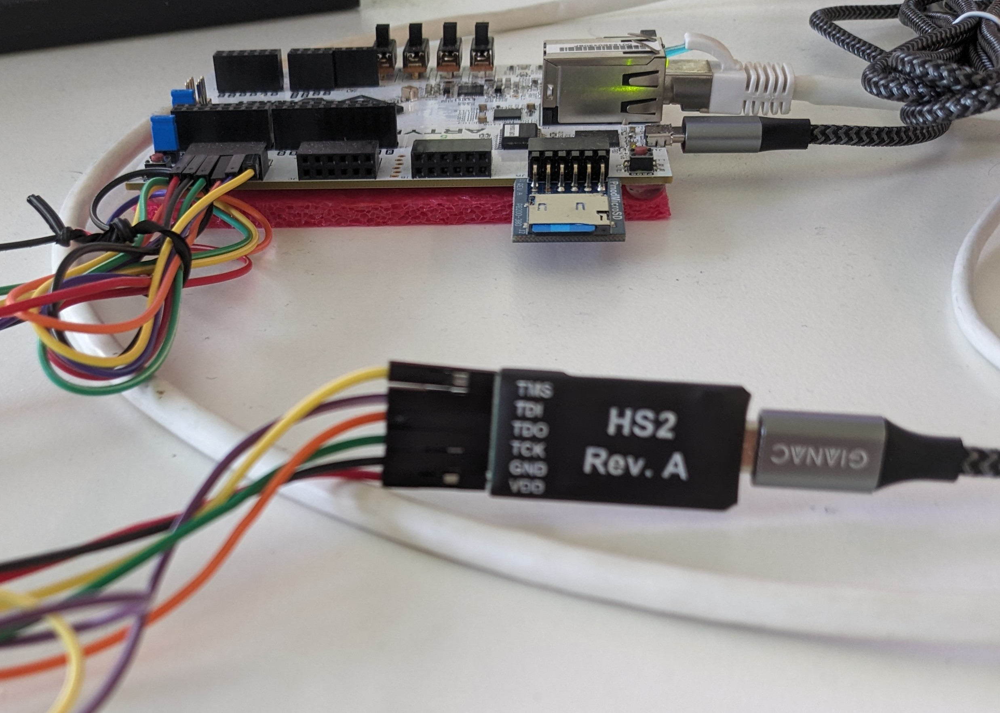
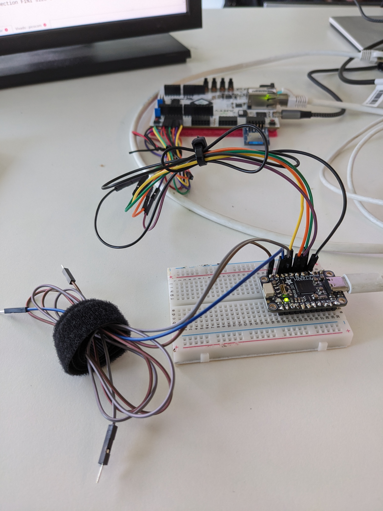

# Trust Nothing Top-Level Project

## Paper

This repository contains the sources and instructions for Bredi and Skadi, a hardware-software implementation of the Northcape capability architecture.
You can learn more in our paper [Trust Nothing: RTOS Security without Run-Time Software TCB](https://TODO).
For instructions about reproducing the experimental results in the paper, please refer to [our lower-level README](./paper_artifact/README.md).
In the remainder of this README, we discuss setup and configuration of Bredi and Skadi.

## Note on Naming
In our paper, we refer to the hardware implementation of Northcape as Bredi and to the operating system as Skadi.
In the code, Bredi is sometimes called *Northcape* or *RVSoC* and Skadi is sometimes referred to as *Zephyr*.
Also, while the paper refers to *subsystem restrictions*, in the code, we call them *task restrictions*.


## Requirements - Hardware

- A [Digilent Genesys2 FPGA board](https://digilent.com/reference/programmable-logic/genesys-2/start) *if you want to run the full SoC with FPU, DMA*.
- A [Digilent Arty A7-100t FPGA board](https://digilent.com/reference/programmable-logic/arty-a7/start) *if you want to run the Northcape-LITE SoC without FPU, with MMIO-only Ethernet*.
- *For the A7 only*, a [Pmod SD](https://digilent.com/reference/pmod/pmodmicrosd/start).
- A MicroSD card capable of running 1-bit SPI (most cards can, tested with, e.g., KIOXIA 64GB EXCERIA)
- 2 USB-A-micro cables
- 1 Ethernet cable
- *For the A7 only*, 1 [Digilent JTAG-HS2 debugger](https://digilent.com/shop/jtag-hs2-programming-cable/) OR a [generic FT232H board](https://www.adafruit.com/product/2264).
- some way to mount the SD card on your build machine
- a build machine compatible with [Vivado's system requirements](https://docs.amd.com/r/en-US/ug973-vivado-release-notes-install-license/Requirements-and-Setup) and a native boot / VM for Ubuntu 22.04

## Requirements - Software

- The hardware project requires [Vivado 2024.2](https://www.xilinx.com/support/download.html).
- We have tested the setup on an AMD Ryzen Threadripper PRO 5995WX with Ubuntu 22.04 LTS
- Running synthesis for the Genesys2 board requires a license for the XC7K325T FPGA. A corresponding license should be bundled with the development board.
- Additionally, as the Genesys2 SoC includes the AXI Ethernet subsystem, a license of type *EF-DI-TEMAC-PROJ* is required. For repeating the experiments in the paper, a free evaluation license suffices.
- The Arty A7-100 board requires *built-in licenses only*, i.e., no purchased licenses are required to build the SoC for that board.

## Hardware setup

### JTAG Color Coding

Please use the following Color Coding Scheme for all JTAG setups:

| Wire  | Color  | PMOD Pin | Notes    |
|-------|--------|----------|----------|
| VCC   | red    | (VCC)    | HS2 only |
| GND   | black  | (GND)    |          |
| TCK   | green  | 4        |          |
| TDO   | orange | 3        |          |
| TDI   | purple | 2        |          |
| TMS   | yellow | 1        |          |
| TRSTN | grey   | 7        | optional |
| RTCK  | brown  | -        | not used |
| SRST  | blue   | -        | not used |

### Genesys2
For the Genesys2, we use the built-in FT232R UART for console and the built-in FT2232H for programming both *the FPGA itself* and debugging *the cva6 soft-core CPU within the FPGA*.

### Arty A7-100
For the ARTY A7, we use the built-in FT2232H for programming *the FPGA itself* and UART.
Again, by using user-defined instruction registers and the *BSCANE2* primitive, it would be possible to program cva6 over the same USB interface. However, we have found that this creates a conflict between Vivado and openocd, making it *impossible to debug hardware and software at the same time*. Hence, again, we use an external FT232H to debug cva6.

Connect one Micro-USB-A cable into the USB header next to the Ethernet jag.
*If you intend to boot Linux*, grab a Pmod SD and connect it to the JA Pmod, VCC->VCC and GND->GND.
The FT232H goes into the JB Pmod, in a straight line starting with VDD->VCC and GND->GND just like the Genesys.

Your setup should resemble this picture:

**Be sure to use the upper row of PMOD pins**.

### Arty A7-100 (Generic FT232 breakout board)
Connect one Micro-USB-A cable into the USB header next to the Ethernet jag.
*If you intend to boot Linux*, grab a Pmod SD and connect it to the JA Pmod, VCC->VCC and GND->GND.
We use color coding to identify which cable of the FT232 mates with which cable in the board (see table above).
As additional help, consider this mapping:


**Be sure to use the upper row of PMOD pins**.
| Signal| FT232H | PMOD LTR |
|-------|--------|----------|
| VCC   |    -   | L        |
| GND   | GND    | L+1      |
| TCK   | D0     | L+2      |
| TDO   | D2     | L+3      |
| TDI   | D1     | L+4      |
| TMS   | D3     | L+5 (R)  |
| TRSTN | D4     | -        |
| RTCK  | D5     | -        |
| SRST  | D7     | -        |

## Building the Hardware Project

### Creating a Vivado project


- Clone the project with submodules:

```bash
    git clone --recursive $URL
```

- Setup the RISC-V toolchain (required for building the Boot ROM):
    - `cd hardware/include/cva6/util/gcc-toolchain-builder`
    - Install dependencies:
    ```bash
    sudo apt-get update && sudo apt-get install --yes autoconf automake autotools-dev curl git libmpc-dev libmpfr-dev libgmp-dev gawk build-essential bison flex texinfo gperf libtool bc zlib1g-dev device-tree-compiler python3 python3-pip help2man &&
    pip install -r ../../verif/sim/dv/requirements.txt
    ```
    - Install RISCV Toolchain:
    ```bash
        export NUM_JOBS=`nproc`
        bash get-toolchain.sh && bash build-toolchain.sh ../../tools/
        cd ../..
        bash ./verif/regress/install-verilator.sh
        source ./verif/sim/setup-env.sh
        bash ./verif/regress/install-spike.sh
        source ./verif/sim/setup-env.sh
        bash ./verif/regress/install-riscv-compliance.sh
        source ./verif/sim/setup-env.sh
        bash ./verif/regress/install-riscv-tests.sh
        source ./verif/sim/setup-env.sh
        bash ./verif/regress/install-riscv-arch-test.sh
    ```
    - Set RISCV environment variables:
    ```bash
        cd tools
        sudo ln -s $(pwd) /opt/riscv
        echo "export RISCV=/opt/riscv" | sudo tee -a /etc/environment
        source /etc/environment # for local shell only...
    ```
    - cd back to the directory this Makefile is in
- Create a Vivado project:
    ```bash
        cd scripts/vivado
       ./create_project.sh # for Genesys2 Board
       ./create_project_arty.sh # for Arty A7-100 Board
    ```

### Creating a bitstream
- To run Vivado interactively:
```bash
   cd scripts/vivado
   ./open_project.sh # for Genesys2 Board
   ./open_project_arty.sh # for Arty A7-100 Board
```
- You can generate a Bitstream in Vivado by clicking "Generate Bitstream" in the Flow Navigator. This will automatically generate output products, run synthesis and run implementation.
- To synthesize a bitstream non-interactively:
```bash
   cd scripts/vivado
   ./create_bitstream.sh # for Genesys2 Board
   ./create_bitstream_arty.sh # for Arty A7-100 Board
```
- The second script will automatically update the bootrom with a device tree that is auto-generated based on the Vivado project. Run the `scripts/Vitis/create_device_tree.sh` script to update the bootrom manually. 

### Programming the development board
- Before programming the board, connect to its USB UART in order to capture all of the output:
```bash
    sudo picocom -b 115200 /dev/serial/by-id/usb-* # or whatever your serial number is, baud rate is the same for both boards
```
- You can press ctrl-a followed by ctrl-x to terminate picocom later.
- The board can be programmed interactively using the "program device" button in the Flow Navigator. First, click Open Target-> Auto Connect. Then, click "program device". Point the dialog to the bitstream (.bit) and possibly probes (ltx) file. Normally, they should be created in [scripts/Vivado/project/RVSoC.runs/impl_1](scripts/Vivado/project/RVSoC.runs/impl_1) or [scripts/Vivado/project_arty/RVSoC.runs/impl_1](scripts/Vivado/project_arty/RVSoC.runs/impl_1), respectively.
- The following TCL commands can be used to automate the process, e.g., for a Genesys2 board:
```tcl
    open_hw_manager
    connect_hw_server
    open_hw_target {localhost:3121/xilinx_tcf/Digilent/123456} # or whatever your serial number is
    refresh_hw_device [lindex [get_hw_devices xc7k325t_0] 0]
    set_property PROBES.FILE {<wherever>/trust_nothing/scripts/Vivado/project/RVSoC.runs/impl_1/SoC_wrapper.ltx} [get_hw_devices xc7k325t_0]
    set_property FULL_PROBES.FILE {<wherever>/trust_nothing/scripts/Vivado/project/RVSoC.runs/impl_1/SoC_wrapper.ltx} [get_hw_devices xc7k325t_0]
    set_property PROGRAM.FILE {<wherever>/trust_nothing/scripts/Vivado/project/RVSoC.runs/impl_1/SoC_wrapper.bit} [get_hw_devices xc7k325t_0]
    program_hw_devices [get_hw_devices xc7k325t_0]
```

Note that the Digilent HS2 JTAG adapter that we use to load zephyr/Skadi onto the board is also compatible with Vivado.
Hence, Vivado will claim it by default, making it impossible to load zephyr/Skadi while the hardware manager is running.
The easy solution to this problem is to *exit the hardware manager* before loading zephyr or Skadi (see below).
If you want to run the hardware manager in parallel, e.g., in order to debug software and hardware at the same time, you can launch a hardware server via the terminal:
```bash
    ./scripts/Vivado/launch_hw_server.sh # for Genesys2 board
    ./scripts/Vivado/launch_hw_server_arty.sh # for Arty A7-100 board
```
The script will add a filter that only binds it to the (author-provided) Genesys 2 / Arty A7 board.
You can then connect to the hardware manager using the Vivado GUI (in Hardware Manager: Open Target->Open New Target-> Use "Remote server" and localhost:3121 and defaults otherwise) or by using the following command in TCL:
```tcl
connect_hw_server -url localhost:3121 -allow_non_jtag
```

## Building the Linux Stack
- Building Linux is automated:
```bash
    cd software/include/northcape-linux-stack && make images # for Genesys2 board
    cd software/include/northcape-linux-stack && BOARD=arty_a7_100 target=cv64a6_imac_sv39 make images # for Arty A7-100 Board
```
- If you encounter missing dependencies, check [.gitlab-ci.yml](gitlab-ci.yml).
- This creates a directory `install64` which contains the `fw_payload.bin` (OpenSBI and U-Boot) and the uImage (vmlinux containing the RootFS). Boot works as follows: fw_payload.bin is written byte-per-byte into a partition on the SD card. The zero-stage bootloader in the FPGA will then load the partition and execute it as-is. uImage is copied into a second FAT32 partition on the same SD. It is then retrieved from the filesystem by u-boot, loaded into memory and executed.
- Flashing the SD card is automated:
```bash
    sudo -E make flash-sdcard SDDEVICE=/dev/sd<whatever> # double-check the device!
```
- U-Boot will boot Linux automatically after five seconds. On the Genesys, it will attempt to boot via TFTP by default; on the Arty, it will boot via the SD card by default.
- See [the Linux documentation](software/include/northcape-linux-stack/README.md) on how to setup a TFTP server.
- Linux will boot into a root shell with no password required, as this is a security project.

## Building the Zephyr stack
- The following script will install all dependencies and build the sample applications:
```bash
cd software/include/northcape-zephyr-stack
./scripts/skadi/ci.sh # will attempt to use sudo to gain root access - run from your normal user account
```
- The script will automatically install missing dependencies (assuming an Ubuntu host).

## Loading the Zephyr stack without root

For the HS2 debugger, the appropriate udev rules are configured as part of the Vivado installation.
For the generic FT232H debugger, you need to add the following udev rules manually, e.g., to /etc/udev/rules.d/80-northcape.rules:
```udev
###########################################################################
#                                                                         #
#  80-northcape.rules -- UDEV rules for FT232s used in Northcape          #
#                                                                         #
###########################################################################
###########################################################################
#  File Description:                                                      #
#                                                                         #
#  This file contains the rules used by UDEV when creating entries for    #
#  FT232H USB devices. In order for openocd                               #
#  applications to access these devices without root privalages it is     #
#  necessary for UDEV to create entries for which all users have read     #
#  and write permission.                                                  #
#                                                                         #
#  Usage:                                                                 #
#                                                                         #
#  Copy this file to "/etc/udev/rules.d/" and execute                     #
#  "/sbin/udevcontrol reload_rules" as root. This only needs to be done   #
#  immediately after installation. Each time you reboot your system the   #
#  rules are automatically loaded by UDEV.                                #
#                                                                         #
###########################################################################

# Create "/dev" entries for Digilent device's with read and write
# permission granted to all users.
ACTION=="add", ATTRS{idVendor}=="0403", ATTRS{idProduct}=="6014", MODE:="666"
```


## Executing the Zephyr stack
- Flashing via west requires a Digilent HS2 or HS2 cable to be inserted into the *JD* PMOD of the Genesys 2, e.g., via jumper cables or a pin stack.
- Make sure to connect the HS2 to the *upper row of pins* of the PMOD.
- Use the following orientation: the *VDD* pin of the HS2 should go to the *leftmost* pin in the PMOD, the *TMS* pin should go to the *rightmost* pin in the Pmod.
- Activate the python venv and use the debug and flash commands provided by Zephyr's *west*:
```bash
    cd software/include/northcape-zephyr-stack
    source .venv/bin/activate
    west build -p always -b cv64a6_genesysII ./tests/benchmarks/northcape-coremark/zephyr # build sample application - Genesys2 Board
    west build -p always -b cv64a6_arty_a7_100 tests/benchmarks/northcape-coremark/zephyr/ # build sample application - Arty A7 100 Board
    export FT232_GENERIC=y; west build -p always -b cv64a6_arty_a7_100 tests/benchmarks/northcape-coremark/zephyr/ # build sample application - Arty A7 100 with FT232H breakout board. Note this needs to be done at BUILD TIME!
    west debug # this will attach GDB to Zephyr before it starts executing; might require sudo with generic breakout board
    west flash # this will run Zephyr immediately without debug; might require sudo with generic breakout board
```
- The commands below the build commands will deploy the latest application that was built, e.g., `coremark`.
- There are two more interesting real-world applications that you can build:
```bash
source .venv/bin/activate
west build -p always -b cv64a6_genesysII samples/net/sockets/dumb_http_server # a simple HTTP server that provides a static website
west build -p always -b cv64a6_genesysII samples/net/zperf # zperf client for network performance measurement with iperf
```
- For both apps, assign the IP address `192.0.2.2/24` to the connected Ethernet interface.
- For the HTTP server, connect to `192.0.2.1:8080` via an HTTP client.
- For zperf, launch an iperf server:
```bash
iperf -s -l 1K -B "192.0.2.2%${INTERFACE} -i 1
```
- Launch zperf in client mode from zephyr's shell:
```bash
zperf tcp upload 192.0.2.2 5001 10000 1K 1G
```
## Running the system from Release Artifacts

### Linux software stack
- Download the Release artifacts from GitLab
- Copy all files starting with `linux64` to `software/include/northcape-linux-stack/install64/`, removing the "linux64" prefix and version suffix:
```bash
    for file in `ls linux64*`; do
        target_file=$(echo $file | sed 's/-v[[:digit:]].*//' | sed 's/linux64-//');
        cp -v $file <wherever>/trust_nothing/software/include/northcape-linux-stack/install64/$target_file;
    done
```
- Copy the `ssh_custom*` and `ssh_custom*pub` files to software/include/northcape-linux-stack/scripts in order to be able to login with ssh using the provided script later.
- Launch the TFTP server or boot manually from the SD card using the u-boot command line as detailed in the [Linux stack README](software/include/northcape-linux-stack/README.md).
- Use the script to generate the SD card:
```bash
    sudo -E make flash-sdcard SDDEVICE=/dev/sdb # double-check SD device!
```
- Insert the SD into the Board.
- Program the board using Vivado as detailed above (but point it to the downloaded bitstream files).
- Be careful to download artifacts **for the correct board**.

### Zephyr software stack option 1: load via openocd
- Download the Release artifacts from GitLab.
- Create the build directory: 
```sh
    mkdir -p software/include/northcape-zephyr-stack/build/zephyr/
```
- Populate the CMake cache by building any executable:
```sh
    west build -p always -b cv64a6_genesysII samples/hello_world # or Arty, respectively - see above
```
- Copy the zephyr ELF file which you would like to run (e.g., `zephyr_http_server.elf`) to `build/zephyr/zephyr.elf`.
- Use the `west flash` command to flash the file:
```sh
    west flash --skip-rebuild
```
- *Use the correct image for the correct board.*

### Zephyr software stack option 2: load via SD
- Download the zephyr.bin from a gitlab release.
- Grab an SD card.
- Write an SD card image:
```sh
    cd software/include/northcape-zephyr-stack
    sudo ./scripts/skadi/write-sd.sh /dev/sdXXX </path/to/zephyr.bin> # doube-check SD device!
```
- Plug the SD card into the FPGA board and program the FPGA via JTAG, USB etc.
- *Use the correct image for the correct board.*

## Capability-Aware Tests / Demonstrations

- See [this script](software/include/northcape-zephyr-stack/scripts/skadi/build-apps.sh) for a list of supported apps.
- All build configurations that do *not contain the phrase* **nocape** are capability-aware.

## FAQ / Porting to Skadi
There is [documentation and a sample available](software/include/northcape-zephyr-stack/samples/boards/openhwgroup/cv64a6/porting/README.md), discussing procedures and common caveats for porting to Skadi and debugging.

You can build and load the sample like this:
```bash
west build -p always -b cv64a6_genesysII samples/boards/openhwgroup/cv64a6/porting/ # Genesys2
west build -p always -b cv64a6_arty_a7_100 samples/boards/openhwgroup/cv64a6/porting/ # Arty
west debug # both
```
